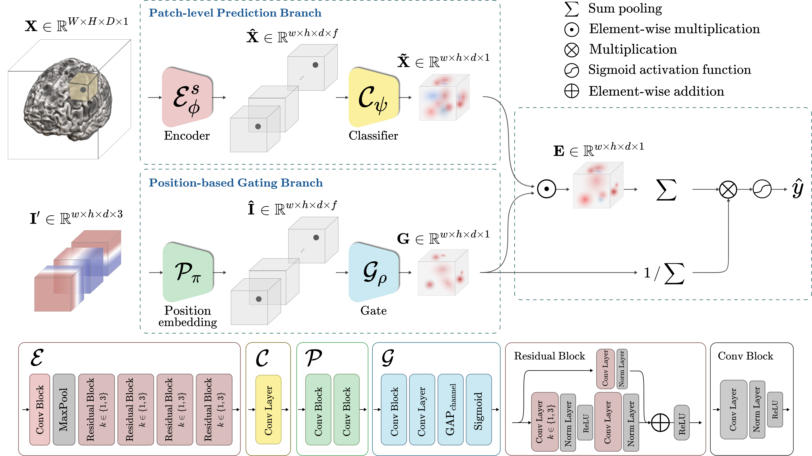

## Deep Joint Learning of Pathological Region Localization and Alzheimer's Disease Diagnosis
<p align="center"></p>

This repository provides the official PyTorch implementation of the following paper:
> **Deep Joint Learning of Pathological Region Localization and Alzheimer's Disease Diagnosis**<br>
> [Changhyun Park](https://github.com/chpark-ML)<sup>1,+</sup>, [Wonsik Jung](https://github.com/ssikjeong1/)<sup>1,+</sup>, [Heung-Il Suk](https://scholar.google.co.kr/citations?user=dl_oZLwAAAAJ&hl=ko)<sup>1</sup> 
> (<sup>1</sup>Korea University) <br/> (<sup>+</sup>: equal contribution)
<!-- > [[Official version]](https://www.sciencedirect.com/science/article/pii/S1053811921004201?via%3Dihub) -->
> [[Official version]](https://www.nature.com/articles/s41598-023-38240-4)[[ArXiv version]](https://arxiv.org/abs/2108.04555) <br>
> Published in Scientific Reports (JCR-IF: 4.997, 2021)
> 
> **Abstract:** *The identification of Alzheimer's disease (AD) using structural magnetic resonance imaging (sMRI) has been studied based on the subtle morphological changes in the brain. One of the typical approaches is a deep learning-based patch-level feature representation. For this approach, however, the predetermined patches before learning the diagnostic model can limit classification performance. To mitigate this problem, we propose the BrainBagNet with a position-based gate (PG), which applies position information of brain images represented through the 3D coordinates. Our proposed method represents the patch-level class evidence based on both MR scan and position information for image-level prediction. To validate our proposed method, we conducted experiments comparing our methods with state-of-the-art methods and evaluating the robust performances of two publicly available datasets: 1) ADNI and 2) AIBL. Furthermore, our proposed method outperformed classification performance in both AD diagnosis and mild cognitive impairment conversion prediction tasks over the comparative methods and analyzed our results from diverse perspectives. Based on our experimental results, we believe that the proposed method has the potential to provide new insights and perspectives in deep-learning based patch-level feature representation studies. Code is available at: \url{github.com/ku-milab/PG-BrainBagNet}.*

## Dependencies
* [Python 3.6+](https://www.continuum.io/downloads)
* [PyTorch 0.4.0+](http://pytorch.org/)
* [TensorFlow 1.3+](https://www.tensorflow.org/) (optional for tensorboard)

## Datasets
* Alzheimer's Disease Neuroimaging Initiative (ADNI)
* Australian Imaging Biomarkers and Lifestyle Study of Ageing (AIBL)

<!-- ## Usage
For training:

`python main.py --dataset='Zero' --data_path=PATH --kfold=5 --impute_weigh=0.1 --reg_weight=0.5 --label_weight=0.5 --gamma=5.0 --cognitive_score=True`
 -->
## Citation
If you find this work useful for your research, please cite our [paper](https://arxiv.org/abs/2108.04555):
```
@article{park2021deep,
  title={Deep Joint Learning of Pathological Region Localization and Alzheimer's Disease Diagnosis},
  author={Park, Changhyun and Suk, Heung-Il},
  journal={arXiv preprint arXiv:2108.04555},
  year={2021}
}
```

## Acknowledgements
This work was supported by Institute of Information \& communications Technology Planning \& Evaluation (IITP) grant funded by the Korea government(MSIT) (No. 2019-0-00079, Artificial Intelligence Graduate School Program(Korea University)) and the National Research Foundation of Korea (NRF) grant funded by the Korea government (No. 2022R1A4A1033856).
